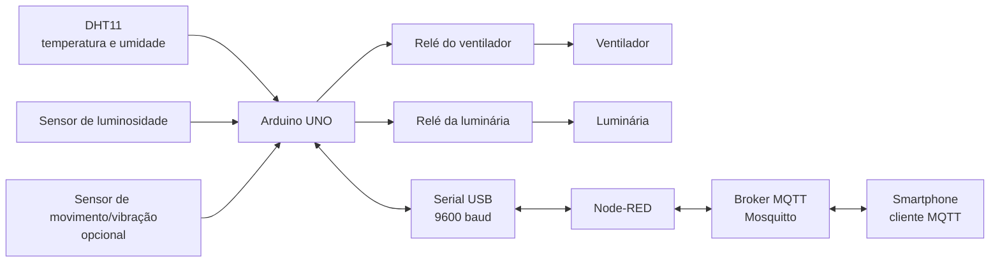

# Automação de Temperatura e Iluminação com IoT

Projeto acadêmico de **Internet das Coisas (IoT) e automação residencial** para monitoramento do ambiente e controle de iluminação e ventilação.

O trabalho original integrou **Arduino UNO**, sensores, relés, **Node-RED**, **MQTT/Mosquitto** e controle por smartphone.

> Projeto desenvolvido na Universidade Presbiteriana Mackenzie.  
> Autores: Michele Teixeira e José Marcos Pereira.  
> Orientação: Prof. Wilian França Costa.

---

## Status desta versão

Os arquivos-fonte originais do Arduino e o export original do Node-RED não estavam mais disponíveis.

Por isso, este repositório contém uma **reconstrução funcional baseada no artigo acadêmico, nas capturas de tela e nos trechos de código preservados no PDF**.

A reconstrução não é apresentada como cópia exata dos arquivos originais.

---

## Objetivos

- monitorar temperatura e umidade;
- monitorar luminosidade;
- acionar ventilador por limite de temperatura;
- controlar iluminação;
- permitir configuração remota;
- publicar telemetria via MQTT;
- disponibilizar controle por smartphone ou outro cliente MQTT;
- manter o sensor de movimento como recurso opcional.

---

## Arquitetura reconstruída



### Por que esta versão usa Serial + MQTT?

O artigo menciona **StandardFirmata** e também mostra um sketch próprio para o DHT11. Para uma reconstrução consistente em um único Arduino UNO, foi adotada uma arquitetura simples:

- Arduino: sensores, automação e relés;
- Serial USB: comunicação local com o computador;
- Node-RED: ponte Serial ↔ MQTT;
- Mosquitto: broker;
- smartphone: monitoramento e comandos.

---

## Estrutura

```text
.
├── .gitignore
├── README.md
├── arduino/
│   └── automacao_luz_temperatura.ino
├── node-red/
│   ├── flows.json
│   └── README.md
├── docs/
│   └── RECONSTRUCAO.md
└── projeto_temperatura_iluminacao_final_1205.pdf
```

---

## Mapeamento de pinos da reconstrução

| Componente | Pino |
|---|---|
| DHT11 | D2 |
| Sensor de movimento/vibração | D3 |
| Relé do ventilador | D8 |
| Relé da luminária | D9 |
| Sensor de luminosidade | A0 |

> O DHT11 em D2 é baseado no trecho preservado no artigo. Os demais pinos foram definidos para esta reconstrução e podem ser alterados no sketch.

---

## Código Arduino

Arquivo:

```text
arduino/automacao_luz_temperatura.ino
```

### Biblioteca

Instale na Arduino IDE:

- `DHT sensor library` da Adafruit

### Recursos implementados

- leitura de DHT11;
- leitura analógica de luminosidade;
- sensor de movimento opcional;
- controle de dois relés;
- limite de temperatura configurável;
- histerese para evitar chaveamento repetitivo;
- modo automático e manual;
- telemetria JSON;
- comandos recebidos por Serial.

---

## Node-RED

Arquivo importável:

```text
node-red/flows.json
```

O fluxo:

- recebe telemetria JSON do Arduino;
- publica valores em tópicos MQTT;
- recebe configurações MQTT;
- converte configurações em comandos Serial;
- encaminha comandos ao Arduino.

Consulte:

[Documentação do fluxo Node-RED](./node-red/README.md)

---

## Tópicos MQTT principais

### Telemetria

```text
casa/ambiente/telemetria
casa/ambiente/temperatura
casa/ambiente/umidade
casa/ambiente/luminosidade
casa/estado/ventilador
casa/estado/luz
casa/estado/movimento
```

### Configuração

```text
casa/config/temperatura_limite
casa/config/histerese
casa/config/luminosidade_limite
casa/config/auto_temperatura
casa/config/auto_iluminacao
casa/config/exigir_movimento
```

### Comando manual

```text
casa/comando/ventilador
casa/comando/luz
casa/comando/status
```

---

## Exemplo de uso

Definir limite de temperatura em 22 °C:

```text
Tópico: casa/config/temperatura_limite
Payload: 22
```

Desativar controle automático do ventilador:

```text
Tópico: casa/config/auto_temperatura
Payload: 0
```

Ligar ventilador manualmente:

```text
Tópico: casa/comando/ventilador
Payload: ON
```

---

## Limitação do projeto original

A funcionalidade de acionamento automático por movimento não foi concluída com sucesso no trabalho original porque o sensor utilizado apresentou problemas.

Nesta reconstrução:

- o sensor de movimento continua suportado;
- seu uso na iluminação é **opcional**;
- por padrão, `motionRequiredForLight = false`.

Isso preserva a honestidade histórica do projeto sem impedir a evolução técnica.

---

## Demonstração original

Vídeo do protótipo:

https://youtu.be/cBocRXDgAyM

---

## Artigo acadêmico

O PDF original contém:

- motivação;
- componentes;
- diagramas;
- montagem;
- capturas do Node-RED;
- trecho do sketch DHT11;
- resultados;
- limitações.

[Consultar o artigo completo](./projeto_temperatura_iluminacao_final_1205.pdf)

---

## Notas da reconstrução

[Leia as decisões, evidências recuperadas e limitações desta reconstrução](./docs/RECONSTRUCAO.md)

---

## Melhorias futuras

- testar fisicamente o sketch com o hardware original;
- calibrar o limiar do sensor de luminosidade;
- substituir o sensor de movimento defeituoso;
- persistir telemetria em banco de dados;
- criar dashboard histórico;
- usar autenticação e TLS no MQTT;
- adicionar testes automatizados da lógica de automação;
- migrar para ESP32 para conectividade Wi-Fi nativa.

---

## Aprendizados

O projeto demonstra conceitos de:

- IoT;
- integração hardware/software;
- sensores e atuadores;
- automação residencial;
- mensageria MQTT;
- publish/subscribe;
- Node-RED;
- comunicação Serial;
- prototipagem com Arduino.
